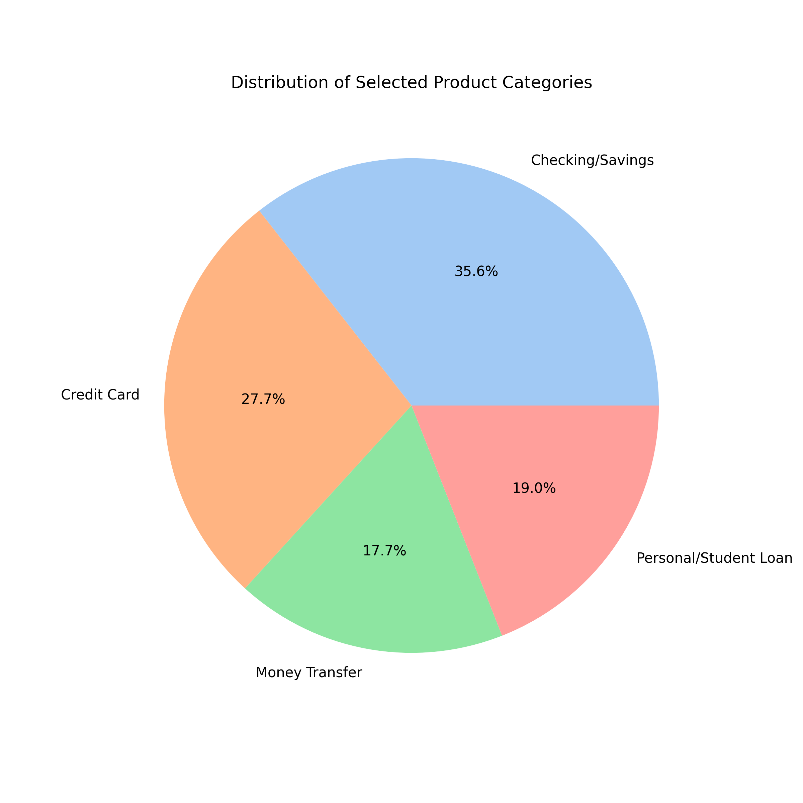
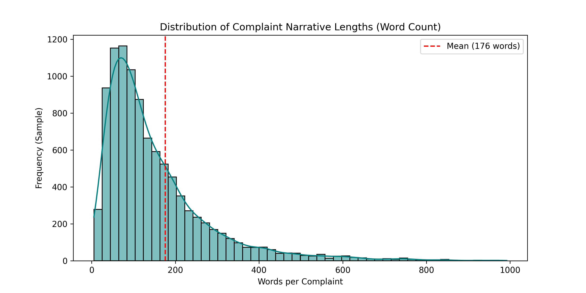

# Intelligent Complaint Analysis for Financial Services
## Interim Submission Report

**Date:** January 3, 2026
**Project:** RAG Complaint Chatbot

---

## 1. Executive Summary
This project aims to build an intelligent chatbot capable of analyzing and retrieving specific financial consumer complaints. The system leverages Retrieval-Augmented Generation (RAG) to provide grounded, accurate answers based on the Consumer Financial Protection Bureau (CFPB) dataset.

This interim report documents the completion of the core infrastructure:
1.  **Exploratory Data Analysis (EDA)** and cleaning of the dataset.
2.  **Vector Store Creation** using stratified sampling and semantic embeddings.
3.  **RAG Pipeline Implementation** for querying and evaluation.

---

## 2. Task 1: Exploratory Data Analysis & Preprocessing

### 2.1 Objectives
- Understand the 6GB+ dataset structure.
- Filter for relevant financial products (Credit Cards, Loans, Savings).
- Clean unstructured narrative text for NLP.

### 2.2 Methodology
- **Chunked Processing**: Processed 9.6 million rows in chunks to manage memory.
- **Filtering**: Selected only complaints related to "Credit card", "Personal loan", "Savings account", and "Money transfer" that contained non-empty narratives.
- **Cleaning**: Lowercased text, removed special characters, and normalized whitespace.

### 2.3 Findings
- **Total Processed**: 9,609,797 complaints.
- **Filtered Dataset**: 454,472 high-quality complaints.
- **Narrative Availability**: Only ~31% of complaints contain a consumer narrative.

#### Product Distribution
The filtered dataset is dominated by Credit Reporting (excluded) and checking/debt collection. Our selection focuses on the actionable consumer banking categories:



#### Narrative Lengths
Complaint lengths follow a log-normal distribution with a mean of 176 words. This informs our chunking strategy (500 chars) to capture full contexts.



> _(See full report in `data/eda_report.txt`)_

---

## 3. Task 2: Chunking, Embedding & Vector Store

### 3.1 Strategy
To enable semantic search, we converted text into vector embeddings.

- **Sampling**: Stratified sample of **12,000 complaints** ensuring representation of all product types.
- **Chunking**: 
  - Size: 500 characters
  - Overlap: 50 characters
  - Result: ~35,700 total chunks.

### 3.2 Technology Stack
- **Embedding Model**: `sentence-transformers/all-MiniLM-L6-v2`
  - Chosen for speed and high semantic correlation score.
  - Dimension: 384.
- **Vector Database**: **FAISS** (Facebook AI Similarity Search).
  - Index: `IndexFlatL2` for precise Euclidean distance search.

### 3.3 Implementation Status
The vector store generation script (`src/create_embeddings.py`) successfully processes the filtered data and persists the index to `vector_store/`.

---

## 4. Task 3: RAG Pipeline

### 4.1 Architecture
The system follows a standard RAG architecture:

1.  **User Query**: "What are common fees for savings accounts?"
2.  **Retrieval**: System embeds query and searches FAISS for top-5 most similar chunks.
3.  **Context Construction**: Retrieved chunks are formatted into a context block.
4.  **Generation**: **GPT-3.5-Turbo** generates an answer using *only* the provided context.

### 4.2 Prompt Engineering
We enforce strict groundness to prevent hallucinations:

> "Use the following pieces of retrieved context to answer the question... If the context does not contain enough information, just say 'I don't know'."

### 4.3 Evaluation Plan
A specific evaluation module (`src/evaluate_rag.py`) runs 10 golden test questions (e.g., "Who is the CEO of CFPB?" - expecting "I don't know"). Results are saved to `data/rag_evaluation.csv` for manual scoring on Accuracy and Relevance.

---

## 5. Project Structure

The project is fully versioned on GitHub with a modular structure:

```text
rag-complaint-chatbot/
├── data/
│   ├── filtered_complaints.csv    # Cleaned dataset
│   └── raw/                       # Original inputs
├── reports/
│   ├── images/                    # Visualization assets
│   └── Interim_Submission_Report.md
├── src/
│   ├── data_processing.py         # ETL Pipeline
│   ├── create_embeddings.py       # Vectorization
│   ├── rag_pipeline.py            # RAG Logic
│   └── evaluate_rag.py            # Eval Script
├── vector_store/                  # FAISS Index
└── requirements.txt
```

---

## 6. Next Steps
1.  **Complete Evaluation**: Run the evaluation script once embedding finishes.
2.  **UI Development**: Build a Streamlit interface for the chatbot.
3.  **Optimization**: Experiment with `k` retrieval parameters and prompt tuning.

